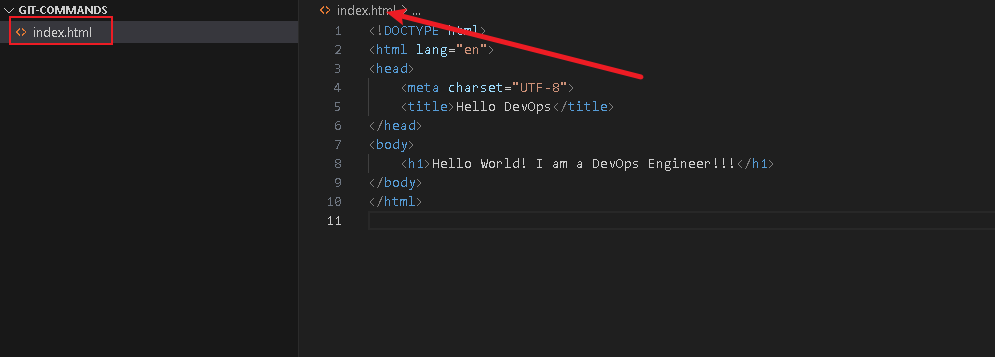
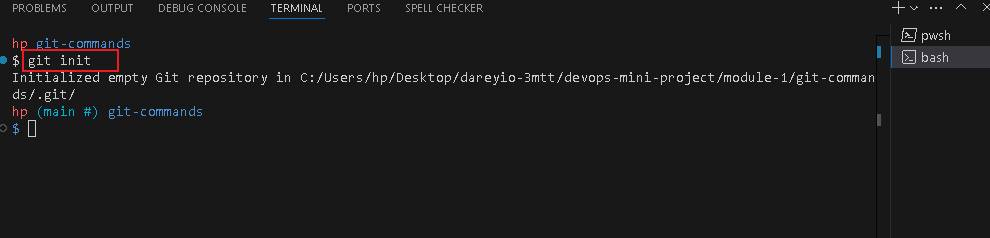
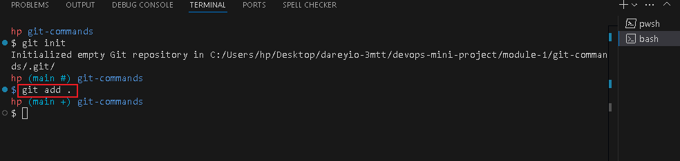
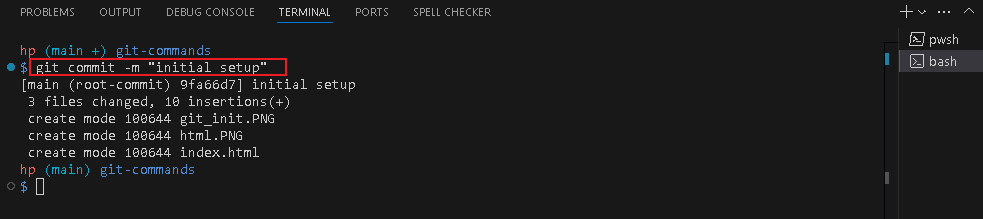
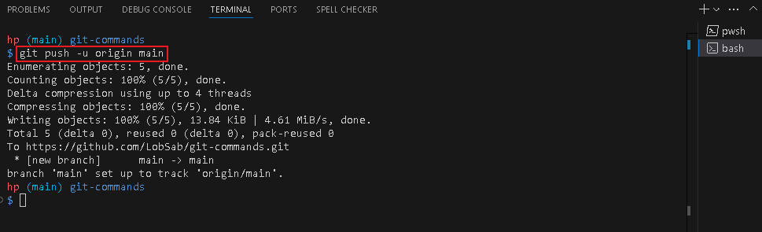

# GIT COMMANDS
## Implementing mini project 2
This showcases the git command mini project on DevOps learning track, 3MTT cohort 3.

### Creating a html file

### Git INIT command

### Git add command

### Git Commit command

### GIT Push command
